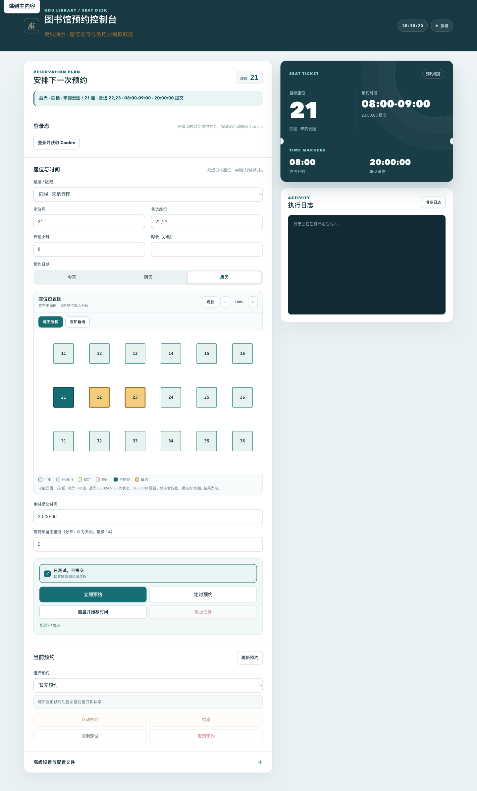

# HDU 图书馆即时预约

[](https://github.com/0D00-0721-0/hdu-library-booking/actions/workflows/tests.yml)

使用自己的浏览器 Cookie 登录态，查询座位、按计划预约，并复核预约、取消、签到和续座结果。提供命令行和本地网页控制台，支持备选座位、定时提交与服务端时钟测量。

这是面向 HDU 图书馆当前接口的个人工具。需要能正常访问并登录官方系统；接口、开放时间及可预约范围以官方服务为准。



*截图使用模拟数据，不包含个人登录态、预约记录或真实楼层平面图。*

## 快速开始

### 1. 安装

推荐 Python 3.11–3.13。以下为 macOS / Linux 命令；macOS 启动脚本优先使用项目内的 `.venv`。

```bash
git clone https://github.com/0D00-0721-0/hdu-library-booking.git
cd hdu-library-booking
python3 -m venv .venv
source .venv/bin/activate
python -m pip install -r requirements.txt
cp config.example.yaml config.yaml
chmod 600 config.yaml
```

后续运行前，先进入项目目录并激活 `.venv`。已有 `config.yaml` 时，保留原文件并对照模板检查字段。

### 2. 填写自己的登录态与计划

推荐使用自动获取 Cookie。先安装可选依赖，然后启动登录：

```bash
python -m pip install -r requirements-login.txt
python instant_book.py --login
```

工具会打开独立浏览器窗口。你在官方页面完成登录和验证码后，工具自动进行只读登录校验，将 Cookie 保存到本机 `cookies/` 目录，并更新配置。优先使用已安装的 Chrome；没有 Chrome 时先执行 `python -m playwright install chromium`。

也可以启动网页后点击“登录并获取 Cookie”。登录窗口会在运行工具的电脑上打开，支持停止任务；5 分钟未完成会超时，失败或取消保留旧登录态。Cookie 过期后再次登录即可。

自动获取是“你完成登录，工具自动保存 Cookie”，无需把账号密码填入项目。手动 Cookie 请求头和 JSON 文件仍受支持，详见 [配置与登录态](docs/configuration.md)。

修改 `booking.plan` 中的楼层、座位和时段。首次使用保留 `dry_run: true`、`session.verify: true`、`hold_before_minutes: 0`。`user_info.uid` 与 `name` 默认留空，由程序自动识别。

### 3. 检查与启动

```bash
python instant_book.py --check-config
python instant_book.py --list-bookings
python instant_book.py --dry-run --days 2 --execute-at ""
python web_app.py --open
```

- `--check-config` 完全离线，只检查配置、参数及 Cookie 文件格式，通过不代表登录仍有效。
- 查询预约和 dry-run 会访问官方服务；dry-run 不预约、不锁座。
- 网页默认在本机访问。macOS 也可双击 `start_web.command`，按 `Ctrl+C` 停止服务。

确认查询与计划正确后，命令行真实预约需将 `booking.dry_run` 改为 `false`；`--dry-run` 始终强制只查询。网页操作前确认“只测试，不提交”选项。取消、签到和续座会实际执行，不受预约 dry-run 开关控制。

## 使用说明

| 内容 | 文档 |
| --- | --- |
| Cookie 格式、配置字段、参数范围与 plan 格式 | [配置与登录态](docs/configuration.md) |
| 命令行示例、备选座位、结果复核、时间测量 | [命令与预约机制](docs/usage.md) |
| 本机启动、页面操作保护、服务重启 | [本机网页控制台](docs/local-console.md) |
| 模块职责、依赖方向与开发入口 | [项目结构](docs/architecture.md) |
| 变更与版本发布准备 | [更新记录](CHANGELOG.md) · [发布说明草稿](docs/releases/v0.1.0.md) |

## 常见问题

- **缺少配置／依赖**：复制示例配置；激活 `.venv`，再使用同一个 Python 安装依赖。
- **配置检查失败**：按提示修正具体字段。重试次数为 1–20，提前预留为 0–14 分钟；布尔值不能加引号。完整规则见配置文档。
- **登录失效／用户不匹配／要求验证码**：重新登录官方页面并更新 Cookie；UID 是慧图内部 ID，不能用学号替代。
- **证书验证失败**：检查系统时间、证书或代理设置，保留 `session.verify: true`。
- **页面已失效／来源不匹配**：刷新控制台；从终端显示的本机地址重新打开页面。
- **结果待确认**：先查询官方预约列表，确认实际状态后再决定后续操作。命令行退出码 `2` 表示结果不确定，`1` 表示普通失败。

## 使用范围与隐私

预约时间使用电脑本地时区，使用前确认系统时区为 `Asia/Shanghai`。定时期间保持电脑唤醒、服务运行；任务不会在服务重启后自动恢复。自动测试使用模拟响应，不能保证当前官方接口一定可预约。

`config.yaml`、Cookie 文件和日志应留在本机。Cookie 文件建议放在已被 Git 忽略的 `cookies/` 目录；日志虽然做了部分脱敏，仍可能包含座位、时段和预约编号，反馈问题前需检查。

## 开发与验证

```bash
python -m unittest discover -v
node test_web_polling.js
```

业务实现已拆到 `libcs/` 包，页面资源位于 `libcs/web/static/`。原有启动命令继续使用；各模块职责见[项目结构](docs/architecture.md)。

可选真实浏览器集成检查：安装登录依赖和浏览器后运行 `LIBCS_BROWSER_TEST=1 python -m unittest test_login_browser -v`，所有图书馆请求均使用模拟响应。

Node.js 仅用于页面测试，运行工具本身不需要。CI 配置覆盖 Ubuntu 的 Python 3.11 / 3.12 / 3.13 与 macOS 的 Python 3.13，并分别检查 UTC 和北京时间。[本轮验证记录](docs/verification.md)区分本地测试与尚未运行的远端 CI。

## 许可证

[MIT License](LICENSE)，版权署名为 GitHub 用户名 `0D00-0721-0`。
