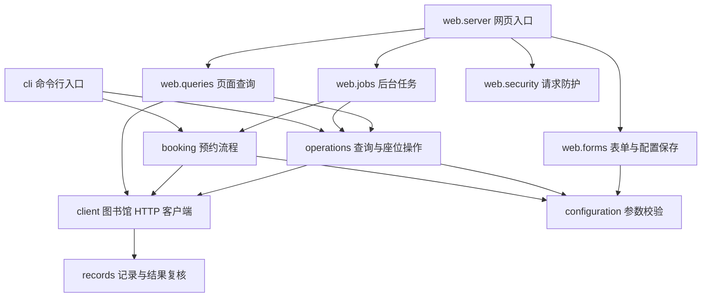

# 项目结构与开发入口

实现代码位于 `libcs/` 包。根目录的 `instant_book.py` 和 `web_app.py` 只负责启动，原来的命令行参数和 macOS 启动脚本继续使用。

## 核心模块

| 文件 | 职责 |
| --- | --- |
| `libcs/login.py` | 独立浏览器登录、Cookie 筛选、只读校验、私密文件写入与配置切换 |
| `libcs/cli.py` | 命令行参数、操作分发、退出码 |
| `libcs/configuration.py` | YAML 读取、计划解析、所有入口共用的参数校验 |
| `libcs/client.py` | Cookie、登录用户识别、HTTP 请求、签名与同账号提交冷却 |
| `libcs/booking.py` | 预约流程：准备、预热、可选预留、主座位与备选座位提交、结果复核 |
| `libcs/operations.py` | 离线配置检查、查询、取消、续座、签到与自动签到 |
| `libcs/records.py` | 预约记录解析、状态含义、服务端结果判断与提交后复核 |
| `libcs/scheduling.py` | 执行时间、时钟差范围、可取消等待 |
| `libcs/privacy.py` | 日志与诊断信息脱敏 |
| `libcs/constants.py`、`libcs/errors.py` | 项目路径、协议常量、可区分的异常类型 |

## 网页模块

| 文件 | 职责 |
| --- | --- |
| `libcs/web/server.py` | HTTP 路由、访问验证、请求与响应、服务器启动 |
| `libcs/web/security.py` | Host、Origin、CSRF、JSON 请求大小及类型检查 |
| `libcs/web/forms.py` | 表单转换、配置路径限制、原子保存配置 |
| `libcs/web/jobs.py` | 后台任务、停止信号、状态快照、任务日志 |
| `libcs/web/queries.py` | 当前预约、座位图与时间测量的页面数据 |
| `libcs/web/settings.py` | 监听地址、访问密码与进程令牌 |
| `libcs/web/assets.py` | 读取固定页面文件及静态资源白名单 |
| `libcs/web/static/index.html` | 页面结构 |
| `libcs/web/static/console.css` | 页面样式 |
| `libcs/web/static/console.js` | 页面交互、API 请求与任务轮询 |

HTML 通过 meta 标签传递本进程的 CSRF 令牌与默认配置文件名；JavaScript 使用 `defer`，在文档解析完成后执行。静态路由只允许固定的 CSS 和 JavaScript 文件，继续经过 Host 与密码验证，不提供项目目录浏览。

## 依赖方向



核心业务模块不导入网页模块。任务注册表和日志锁归 `web.jobs` 管理，网页配置保存与登录配置更新共用 `login.CONFIG_LOCK`。预约记录复核接收客户端对象，不反向导入 `client`，避免循环依赖。

根目录启动脚本不再兼任可导入的业务模块。需要在自己的 Python 代码或测试里调用功能时，从实际模块导入，例如：

```python
from libcs.booking import run_booking
from libcs.configuration import load_config
from libcs.errors import ResultUncertain
from libcs.operations import check_config
```

## 修改与验证

- 改参数规则：修改 `configuration.py`，同时检查 CLI 和网页入口的回归测试。
- 改接口或签名：修改 `client.py`；对应离线测试覆盖请求体、提交冷却和结果复核。
- 改页面：修改 `web/static/` 下的文件，运行 JavaScript 检查并重启本机服务。资源在进程启动时读取。
- 改 HTTP API：修改 `web/server.py`，保留统一的请求防护与异常映射。

```bash
python -m unittest discover -v
node test_web_polling.js
```

现有测试按业务情境保留，模拟对象改为指向所属模块。`test_module_boundaries.py` 额外验证从其他目录运行启动脚本、退出码、模块导入无网络副作用和静态资源访问边界。`test_support.py` 为拆分后的模块提供一致的测试时钟。

`config.yaml`、Cookie 和 `logs/` 仍位于项目根目录或用户配置的位置；默认路径根据源文件位置定位，不依赖启动时的工作目录。模块拆分没有新增核心运行依赖；自动登录通过 `requirements-login.txt` 提供可选 Playwright 依赖，普通查询和手动 Cookie 不需要安装。任务依然驻留在单个进程内，重启不会恢复任务。
